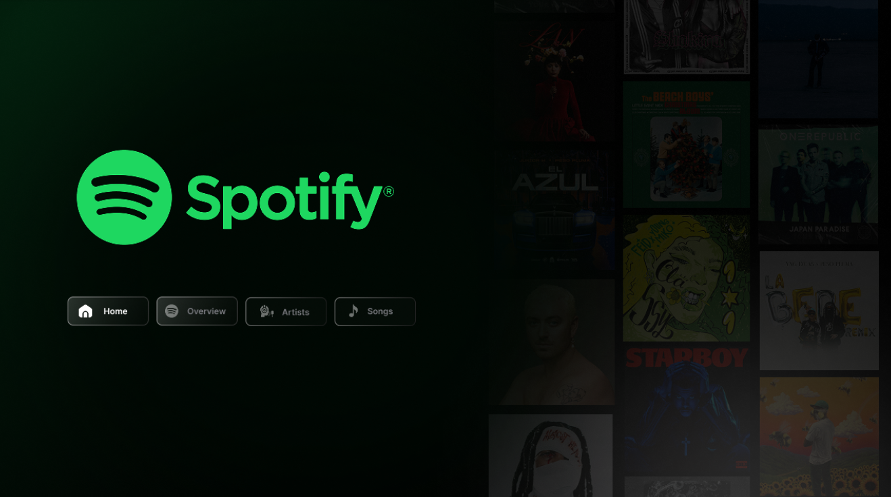
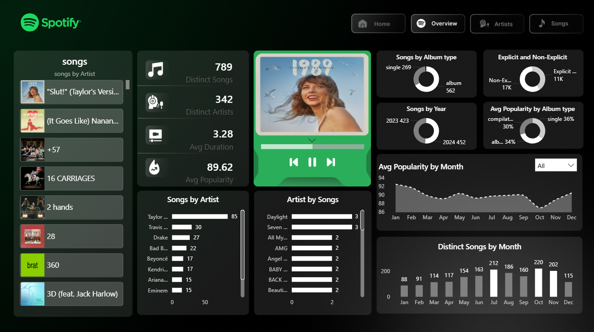
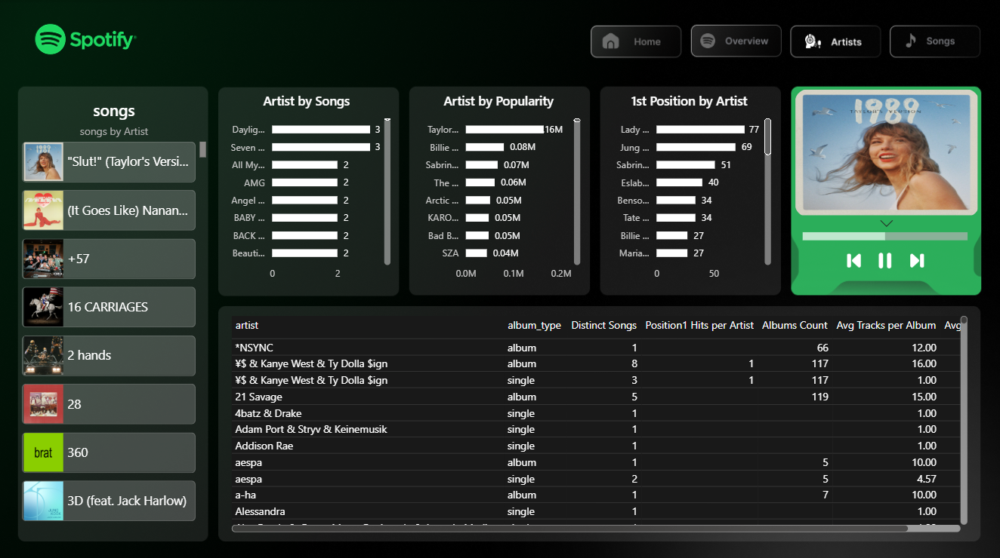
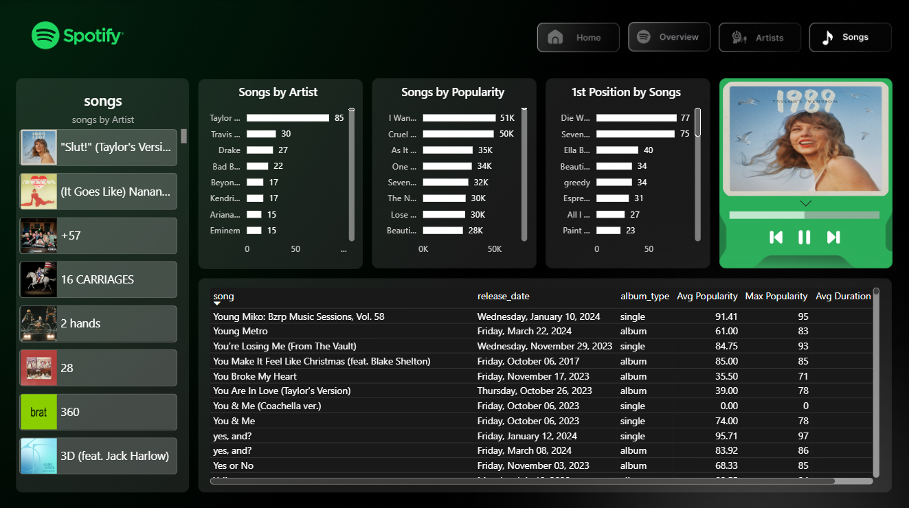

# 🎵 Spotify Dashboard 

An interactive Power BI dashboard that analyzes Spotify chart data — covering songs, artists, popularity trends, and album insights across a 18-month period.

---

## 📸 Dashboard Preview

| Home | Overview |
|------|----------|
|  |  |

| Artists | Songs |
|---------|-------|
|  |  |

---

## 📊 Dataset

| Field | Description |
|-------|-------------|
| `date` | Chart date |
| `position` | Chart position (rank) |
| `song` | Song name |
| `artist` | Artist name |
| `popularity` | Spotify popularity score (0–100) |
| `duration_ms` | Song duration in milliseconds |
| `album_type` | Album / Single / Compilation |
| `total_tracks` | Number of tracks in the album |
| `release_date` | Song release date |
| `is_explicit` | Whether the song contains explicit content |
| `album_cover_url` | Album cover image URL |

**Dataset Summary:**
- 📅 Date Range: May 2023 → November 2024
- 🎵 Total Records: ~27,800 chart entries
- 🎧 Distinct Songs: 789
- 🎤 Distinct Artists: 342
- ⭐ Avg Popularity: 89.62

---

## 📐 DAX Measures

The dashboard includes the following custom DAX measures:

| Measure | Description |
|---------|-------------|
| `Distinct Songs` | Count of unique songs |
| `Distinct Artists` | Count of unique artists |
| `Distinct Songs per Artist` | Songs count per artist |
| `Total Songs` | Total song entries |
| `Songs per Artist` | Songs aggregated by artist |
| `Songs per Year` | Songs breakdown by year |
| `Singles Count` | Count of single-type releases |
| `Albums Count` | Count of album-type releases |
| `Album Type Count` | Count per album type |
| `Avg Popularity` | Average popularity score |
| `Avg Popularity per Artist` | Popularity average per artist |
| `Avg Popularity per Year` | Popularity average per year |
| `Avg Popularity Explicit` | Avg popularity for explicit songs |
| `Avg Popularity NonExplicit` | Avg popularity for non-explicit songs |
| `Max Popularity` | Maximum popularity score |
| `Min Popularity` | Minimum popularity score |
| `Avg Duration Minutes` | Average song duration in minutes |
| `Avg Duration per Year` | Avg duration broken down by year |
| `Max Duration Minutes` | Maximum song duration |
| `Min Duration Minutes` | Minimum song duration |
| `Avg Tracks per Album` | Average number of tracks per album |
| `Avg Position` | Average chart position |
| `Position 1 Songs` | Songs that reached #1 position |
| `Position 1 Artists` | Artists that reached #1 position |
| `Position1 Hits per Artist` | Number of #1 hits per artist |
| `Explicit Songs` | Count of explicit songs |
| `Non-Explicit Songs` | Count of non-explicit songs |
| `Pct Explicit Songs` | Percentage of explicit songs |
| `Pct Explicit per Year` | Explicit song percentage per year |

---

## 📑 Dashboard Pages

### 🏠 Home
Landing page with Spotify branding and navigation buttons to all sections.

### 📈 Overview
High-level KPIs and trends:
- Total distinct songs & artists
- Avg duration & avg popularity
- Songs by album type (donut chart)
- Explicit vs non-explicit breakdown
- Songs by year
- Avg popularity by album type
- Avg popularity by month (line chart)
- Distinct songs by month (bar chart)

### 🎤 Artists
Artist-focused analysis:
- Artist by number of songs (bar chart)
- Artist by popularity (bar chart)
- Artists with #1 chart positions
- Detailed artist table (album type, distinct songs, hits, avg tracks, etc.)

### 🎵 Songs
Song-level deep dive:
- Songs by artist (bar chart)
- Songs by popularity (bar chart)
- Songs that reached #1 position
- Detailed song table (release date, album type, avg & max popularity, duration)

---

## 🛠️ Tools & Technologies

- **Power BI Desktop** — Dashboard design & DAX measures
- **CSV (Spotify.csv)** — Source data (~27,800 rows)
- **DAX** — 29 custom measures for KPIs and calculations

---

## 🚀 Getting Started

1. Clone or download the repository
   ```bash
   git clone https://github.com/your-username/spotify-dashboard.git
   ```
2. Open `Spotify_Dashboard.pbix` in **Power BI Desktop**
3. Make sure `Spotify.csv` is in the same directory as the `.pbix` file
4. Refresh the data source if prompted
5. Explore the 4 dashboard pages using the navigation buttons

---

## 📁 Project Structure

```
spotify-dashboard/
│
├── Spotify_Dashboard.pbix   # Power BI dashboard file
├── Spotify.csv              # Source dataset
├── README.md                # Project documentation
└── Images
    ├── Home.png
    ├── Overview.png
    ├── Artist.png
    └── Song.png
```

---

## 💡 Key Insights

- 🏆 **Taylor Swift** leads with 85 songs on the charts — far ahead of Travis Scott (30) and Drake (27)
- 📅 **July** sees the highest number of distinct charting songs (212)
- 🔥 Explicit songs make up **~40%** of all chart entries
- 💿 Albums account for **562** of the charted songs vs **269** singles
- ⭐ Average popularity score across all tracks is **89.62 / 100**

---

## 🤝 Contributing

Feel free to fork this repo, suggest improvements, or open an issue if you spot anything!
